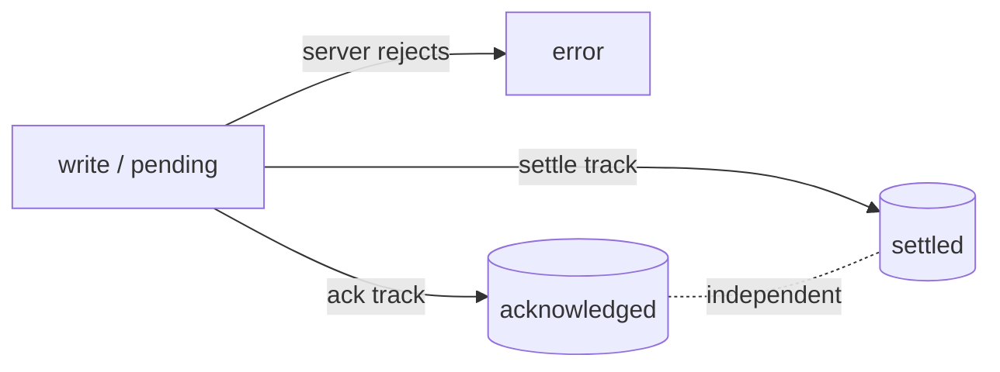
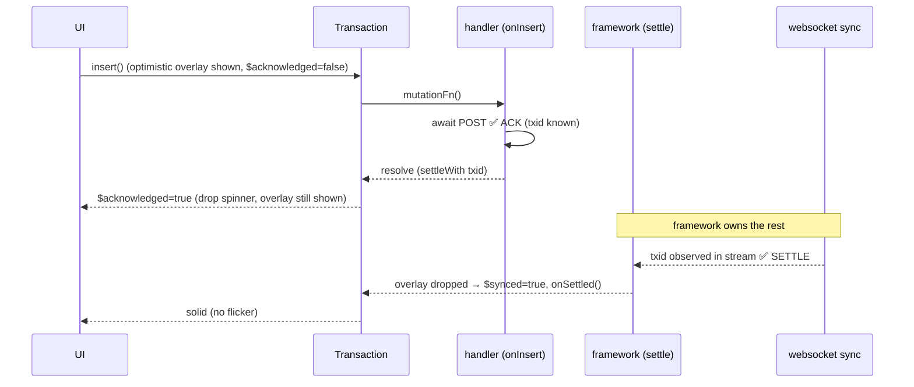

# Proposal: `acknowledged` vs `settled` — a UI-facing optimistic confirmation state

**Status:** Draft for discussion
**Scope:** `@tanstack/db` (virtual props + transaction milestones) and `@tanstack/electric-db-collection` (handler decoupling)
**Non-goal:** Adding a new `TransactionState`. This adds a *UI* signal, not a *framework* state.

---

## TL;DR

Optimistic mutations have two **independent** confirmations, not one:

1. **acknowledge** — the server accepted the write (the POST/RPC resolved; in Electric, the `txid` is now known).
2. **settle** — the write was observed coming back through sync (Electric: the `txid` appeared in the replication stream), so the optimistic overlay can be dropped with no flicker.

Today these are collapsed into a single `persisting → completed` edge, because the Electric handler `await`s **both** inside one `mutationFn`. Every UI-facing signal (`$synced`, `$origin`, `isPersisted`) therefore flips only at **settle**.

But for most UIs, **acknowledge is the signal that matters** — once the server has the write, it's safe to drop the spinner. Settle is plumbing: it exists so the overlay swap is seamless, which is a *framework* concern, not the UI's.

This proposal:

- exposes **`$acknowledged`** as a new virtual prop (additive, non-breaking; always `true` when `$synced` is `true`);
- lets the handler **resolve at acknowledge** and hands the settle-wait to the framework via **`onSettled` / `settleWith`**, so apps stop holding the handler open just to keep the overlay alive;
- keeps the anti-flicker overlay-hold entirely inside the framework.

---

## The reframing: it's not a linear state machine

The confusion in the thread ("is it 4 states or 5?") comes from trying to read this as a single linear chain. It isn't. There are **two orthogonal confirmation tracks** plus a terminal error:



Each track is a boolean. They can complete in **either order**:

- `write → ack → settle` (normal: POST returns, then sync catches up)
- `write → settle → ack` (the "5th case": the websocket row arrives *before* the POST response)

That second ordering is exactly what breaks the linear reading. You **cannot** infer history from a single current token, because `settle` is not always preceded by `ack` and vice-versa. The moment you model it as **two independent bits** instead of one chain, the paradox dissolves:

| `acknowledged` | `settled` | meaning                                            | UI                    |
| -------------- | --------- | -------------------------------------------------- | --------------------- |
| `false`        | `false`   | in flight, server hasn't confirmed                 | tentative / spinner   |
| `true`         | `false`   | **server has it**, sync hasn't caught up           | solid (drop spinner)  |
| `true`         | `true`    | fully reconciled, overlay dropped                  | solid / no indicator  |
| `false`        | `true`    | settle landed first; ack still pending             | (transient) solid     |
| —              | —         | `error`                                            | error / rollback      |

Two bits = four combos, plus error. That's why it *felt* like "4 but maybe 5": it's 4 **journeys** through 2 tracks, and the fifth journey (`settle` before `ack`) is the one a linear model can't represent.

### The journeys, enumerated

```
write
write → error
write → ack
write → ack → settle
write → settle → ack      ← the ordering that breaks a single linear chain
```

The key realization: **whatever the current value is, the only safe way to know "what came before" is two independent flags**, not one ordered enum. So we don't want a new ordered state — we want a second boolean.

---

## What exists today

| Signal                         | Where                                         | Flips at | Notes                                                              |
| ------------------------------ | --------------------------------------------- | -------- | ----------------------------------------------------------------- |
| `TransactionState`             | `packages/db/src/types.ts:64`                 | settle   | `pending \| persisting \| completed \| failed`                    |
| `Transaction.isPersisted`      | `packages/db/src/transactions.ts:214,232`     | settle   | resolves when `mutationFn` resolves                               |
| row `$synced`                  | `packages/db/src/collection/state.ts:160`     | settle   | `!optimisticUpserts.has(key) && !optimisticDeletes.has(key)`      |
| row `$origin`                  | `packages/db/src/collection/state.ts:172`     | settle   | `'local'` while any optimistic overlay exists on the key          |

The Electric handler is what wires "settle" into `mutationFn` (`packages/electric-db-collection/src/electric.ts`, the `wrappedOnInsert`/`wrappedOnUpdate`/`wrappedOnDelete` ~877):

```ts
const wrappedOnInsert = config.onInsert
  ? async (params) => {
      const handlerResult = await config.onInsert!(params) // ① ACK: POST → { txid }
      await processMatchingStrategy(handlerResult)         // ② SETTLE: awaitTxId(txid) — blocks here
      return handlerResult                                 // tx 'completed' only after BOTH
    }
  : undefined
```

Because step ② runs inside the handler, the transaction stays `persisting` across the whole window and there is **no observable edge at ACK**.

### The machinery already separates the two internally

`recomputeOptimisticState` (`packages/db/src/collection/state.ts:465`) already distinguishes:

- **active** transactions (`persisting`) → their mutations populate the overlay as *not-yet-acknowledged* (`state.ts:590+`);
- **completed** transactions → their mutations move into `pendingOptimisticUpserts` / `pendingOptimisticDeletes` (`state.ts:485-522`), i.e. *acknowledged-but-not-yet-dropped*.

So the active-vs-pending boundary is **already computed** — today it just happens to land at settle (because `completed` == settle). This proposal mostly (a) **exposes** that boundary as `$acknowledged`, and (b) **moves** it to ACK by letting the handler resolve earlier.

---

## Proposal

### 1. New virtual prop: `$acknowledged` (the UI's main concern)

```ts
// packages/db/src/virtual-props.ts
export interface VirtualRowProps<TKey extends string | number = string | number> {
  /**
   * Whether the backend has *accepted* this row's pending write (≥1 confirmation),
   * independent of whether it has finished syncing back.
   *
   * - `true`:  server has the write (handler resolved) OR the row is fully synced.
   * - `false`: write is still in flight; no confirmation yet.
   *
   * Always `true` when `$synced` is `true`. For local-only collections, always `true`.
   *
   * This is the signal most UIs want: drop the spinner here, not at `$synced`.
   */
  readonly $acknowledged: boolean

  readonly $synced: boolean        // unchanged — true only once the overlay is dropped (settled)
  readonly $origin: VirtualOrigin  // unchanged
  // ...
}
```

Computation reuses the existing active-vs-pending split:

```ts
// packages/db/src/collection/state.ts (alongside isRowSynced, ~160)
public isRowAcknowledged(key: TKey): boolean {
  if (this.isLocalOnly) return true
  if (this.isRowSynced(key)) return true
  // Acknowledged === the overlay for this key comes from a COMPLETED transaction
  // (handler resolved) rather than an in-flight (persisting) one.
  return (
    (this.pendingOptimisticUpserts.has(key) || this.pendingOptimisticDeletes.has(key)) &&
    !this.hasActiveOptimisticMutation(key)
  )
}
```

Truth table the UI gets, for free, per row:

```ts
!row.$acknowledged                    // → spinner: server doesn't have it yet
 row.$acknowledged && !row.$synced    // → solid; quietly reconciling (no spinner)
 row.$synced                          // → fully settled
```

> **Why a new prop, not a 3-valued `$origin`?** We considered widening `$origin` to `'local' | 'server' | 'remote'`. Rejected: it overloads "where did this come from" with "how confirmed is it," is a breaking semantic change to queries that already filter `eq($origin, 'local')`, and conflates two orthogonal axes that the two-bit model says should stay separate. `$acknowledged` is additive and composes with `$synced`.

### 2. Decouple the handler: resolve at ACK, let the framework own settle

So apps don't hold the handler open purely to keep the overlay alive, give the transaction a way to register a framework-owned settle promise:

```ts
// packages/db/src/transactions.ts — additive
class Transaction<T> {
  public isPersisted: Deferred<Transaction<T>>   // unchanged: resolves at handler resolve (= ACK now)
  public isSettled: Deferred<Transaction<T>>     // NEW: resolves when the registered settle completes

  /** Register a framework-owned settle step. The overlay for this tx's keys is held
   *  until `fn()` resolves, then dropped seamlessly; `onSettled` fires after. */
  settleWith(fn: () => Promise<unknown>): void { /* ... */ }
}
```

Electric handler becomes:

```ts
const wrappedOnInsert = config.onInsert
  ? async (params) => {
      const handlerResult = await config.onInsert!(params) // ① ACK
      // hand the settle wait to the framework instead of blocking the handler:
      params.transaction.settleWith(() => processMatchingStrategy(handlerResult)) // ② SETTLE (framework-owned)
      return handlerResult   // resolves NOW → $acknowledged flips; overlay HELD until settle
    }
  : undefined
```

Result:

- `$acknowledged` flips as soon as the POST resolves — **snappy UI**, no waiting on the websocket.
- The overlay is still held until settle, by the **framework**, so the eventual swap is flicker-free — **the UI never thinks about the overlay** (your stated principle).
- `transaction.isSettled` / an `onSettled` collection callback is available for the rare consumer that cares about full reconciliation (analytics, "fully synced" badges, tests).



---

## The pitch to users (why anyone should care)

> Your optimistic UIs are probably waiting one network round-trip too long. Today the
> "pending" overlay clears only after the write round-trips through sync. But the moment
> that matters to a user is **acknowledge** — the server has the write; it's not going to
> be lost. Switch `!row.$synced` → `!row.$acknowledged` and your spinners clear a full
> replication-lag sooner, with zero correctness loss. Settle keeps happening; the framework
> just stops making your UI wait for it.

Correctness caveat to state plainly: dropping the tentative affordance at ACK assumes an
acknowledged write **will** settle. If your backend can ACK a write that then fails to
replicate, that's a server bug surfacing as a stuck/again-optimistic row — and `onSettled`
(or a settle timeout) is where you'd detect it.

---

## Userland prototype (works **today**, no core changes)

You can get the `acknowledged` behavior right now by emitting the ACK yourself from the
handler and keeping the existing settle-await. This is the thing to prototype before
committing the framework to an API:

```ts
import { Store } from '@tanstack/store'

/** Per-key "server has it" signal, driven from the handler's ACK. */
const acknowledged = new Store<Set<string>>(new Set())
const ack = (key: string) =>
  acknowledged.setState((s) => new Set(s).add(key))
const clearAck = (key: string) =>
  acknowledged.setState((s) => { const n = new Set(s); n.delete(key); return n })

const todos = createCollection(
  electricCollectionOptions({
    // ...shape config...
    onInsert: async ({ transaction }) => {
      const { changes } = transaction.mutations[0]
      const { txid } = await api.todos.create(changes) // ① ACK
      ack(String(changes.id))                          // UI can drop the spinner NOW
      return { txid }                                  // wrapper still awaits ② settle (overlay held)
    },
  }),
)

// In a component:
// const isPending = !acknowledged.state.has(String(row.id)) && !row.$synced
// clear on settle: subscribe to the collection and clearAck(key) when row.$synced flips true
```

This is exactly the `acknowledged.add(...)` side-channel from the discussion. It proves the
UX with no framework changes; `$acknowledged` + `settleWith` simply make it first-class and
remove the bookkeeping.

---

## Open questions for maintainers

1. **`$acknowledged` semantics for non-Electric collections.** For query/mutation collections
   that resolve their handler on the POST and have no separate settle, `$acknowledged` and
   `$synced` would flip together. Fine? (It degrades gracefully to today's behavior.)
2. **Should `settleWith` be Electric-specific or a generic `Transaction` capability?** The
   overlay-hold is generic (already keyed on synced data arrival), but the *trigger* (txid)
   is Electric-specific. Leaning generic with Electric providing the promise.
3. **`onSettled` placement** — collection-level config callback, a `transaction.isSettled`
   promise, or both? `isSettled` is cheap and composes; `onSettled` config is ergonomic.
4. **Settle timeout / failure surface.** If a write is acknowledged but never settles, do we
   reject `isSettled`, re-mark the row, or leave it to the consumer? (Today `awaitTxId` has a
   5s timeout that currently rejects the whole `mutationFn`.)
5. **Backward compatibility of moving `isPersisted` to ACK.** `isPersisted` currently resolves
   at settle. If the handler resolves at ACK, `isPersisted` resolves at ACK too. We may want
   `isPersisted` to keep meaning "settled" and add `isAcknowledged` instead — naming TBD.
